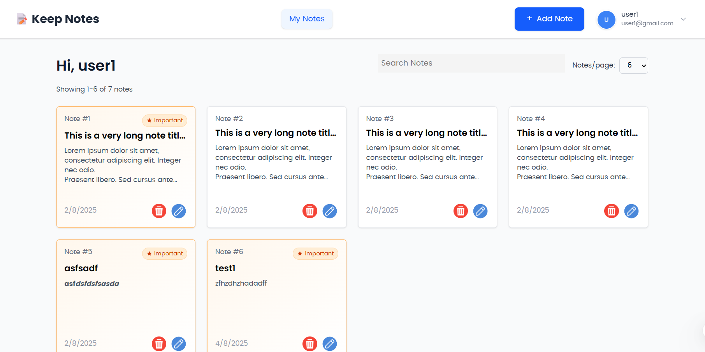

# 📝 Keep Note

A simple and elegant note-taking web application built for productivity and ease of use.



---

## ✨ Features

- 📝 **Create & Edit Notes** – Write and update your notes with a clean, intuitive interface
- ❗ **Mark as Important** – Highlight important notes for quick reference
- 🔍 **Search Functionality** – Instantly find notes using keywords
- 📅 **Pagination & Sorting** – Easily manage large numbers of notes
- 👤 **User Authentication** – Register, login, and manage your account securely
- 🎨 **Responsive UI** – Works beautifully across desktop and mobile devices

---

## 🚀 Technologies Used

- **Frontend**: React + TypeScript + TailwindCSS
- **Backend**: Node.js + Express
- **Database**: MongoDB (with Mongoose)
- **Authentication**: JWT (JSON Web Token)
- **Build Tool**: Vite

---

## 📦 Installation

### 1. Clone the repository

```bash
git clone https://github.com/HOKAGEMINATO222/keep-note.git
cd keep-note
```

### 2. 🔧 Backend Setup

```bash
cd backend
npm install
```

Create a `.env` file inside the `backend/` folder with the following content:

```env
MONGO_URL=your_mongo_connection_string
JWT_SECRET=your_jwt_secret_key
```

Start the backend server:

```bash
npm start
```

---

### 3. 💻 Frontend Setup

Open a new terminal tab and run:

```bash
cd frontend
npm install
npm run dev
```

Then open your browser and go to:

```
http://localhost:5173
```
